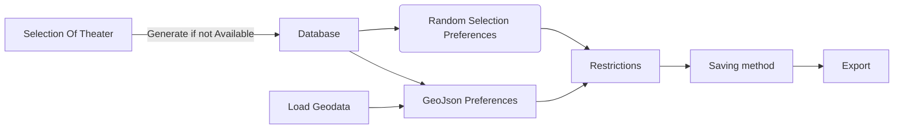

# Welcome to Building Generator (v0.95b) for Falcon BMS !


The **Building Generator** is a powerful tool designed for Falcon BMS developers and contributers. It allows you to seamlessly transform geographical data from OpenStreetMap, QGIS, or other GIS systems, into Falcon BMS-compatible files. These files can then be loaded into the Falcon BMS simulator, enriching the virtual environment with realistic structures.

## Key Features:

1. **GeoJSON Support**:
   
   - Load building structures in GeoJSON format.
   - Seamlessly import complex building geometries.

2. **Falcon BMS Integration**:
   
   - Generate Falcon BMS files (Editor format) containing building information.
   - Enhance your virtual world by adding accurate, detailed structures.

3. **Files and Folders Manager**:
   
   - The software efficiently manages its own files and folders.
   - Simplify your workflow with an organized structure.

4. **Customization**:
   
   - Filter, sort, and select buildings based on general characteristics.
   - Configure preferences through the user interface for seamless data injection.


Whether you’re creating realistic urban landscapes, military bases, or entire cities, the Building Generator streamlines the process, making it a valuable asset for both hobbyists and professional developers.

# Let's Start

Installation is made by extracting the files from the compressed Zip file. after that, launching the Exe file of the software will open the Graphical user interface that you will work with.


## Requirments

* Add exception for Antivirus (Some are sensitive for Exe made by python)

* Baisc knowledge of OpenStreetMap keys and features 

* OverPass-Turbo or Qgis with QuickOSM plugin are needed

* any kind of Text softwares (Notepad++ is recommended)

* Basic Knowledge of Falcon BMS Editor, Objectives viewer and how the Database look like


## DashBoard - First Screen


After opening the software, you’ll notice three main areas:

1. **Left Toolbar**:
   
   - Allows you to navigate between four different screens and open the settings window.

2. **Lower Part of the Screen**:
   
   - Provides information about the selected Class Table (CT), along with relevant details about the theater and BMS version that have been detected.
   - Custom information may also be displayed based on the current page.

3. **Main Screen**:
   
   - Displays relevant data for each page.


### Overview

The overview section presents graphic and statistical information about the data that has been gathered since the beginning of usage.

### BMS Versions Detected

In this window, you can view all the detected simulator versions of BMS that are recognized by Windows. The information is retrieved directly from the registry.

### Database Detected

This table lists all the databases that have been generated by the software.

### FalconCT Path

At the lower part of the screen, you can select your “base of operations,” which is the Class Table XML file. This file enables the software to collect essential information such as paths, theater details, BMS version, and available databases. The path will be displayed across all main screens, ensuring clarity about the data source.

> Note: The CT path is limited to Main Theaters (those containing CT/FCD/Parents information). Sub-theaters without proper databases are not supported.

 

## Database - Second Screen


To enable the injection of structures into Falcon BMS, our software requires its own database. This database serves as the foundation for calculating, measuring, and injecting structures and features from the selected theater into Falcon BMS.

to be able to do that, locate the Class Table XML file for your desired theater. For example, the Korea Theater (KTO) Class Table XML file is located at:

> "Falcon BMS 4.XX\Data\TerrData\Objects\Falcon4_CT.xml"


- If a database is available for the theater, it will be auto-loaded, indicated by a green image labeled “Available.” Otherwise, a red image will indicate “Not Available.”


### Backup Class Table

Starting from Falcon BMS 4.37U4, a new feature allows drawing models and textures directly from the KTO default folder. This approach helps theaters save storage space, allowing dedicated storage for unique features. 

If a certain theater is using this data redirection, a backup Class Table is needed to fetch the original models from the Korea theater. Clicking on “**Backup CT Path**” bar will open a window to select the Class Table of KTO (unless the code evolves into a more complex feature, allowing any theater to serve as its base).


### Generating Database

After selecting the desired Class Tables, clicking on the yellow button labeled **"Generate Database"** will produce the calculated information and show it on the list of buildings.


### List of buildings

The information from the calculated database will be presented here. sorthing the columns is possible by clicking on the desired title. However, backward sorting is not supported.

The tiltles are as follows:

> "ModelNumber" - Parent Number of the "Normal" varient
> "Type" - Classification of the model (Warehouse, Bunker, AmmoDump etc)
> "CTNumber" - The Assosiate Class Table number
> "EntityIdx" - The Assosiate Feature Class Table number
> "Width" - Width of the fitted bonding box (shorter face) in feet
> "WidthOff"-   Offset from the center on the same axis of "Width" in feet
> "Length" - Length of the fitted bonding box (longer face) in feet
> "LengthOff" - Offset from the center on the same axis of "Length" in feet
> "Height" - height in in feet
> "LengthIdx" - Index of longer face 


## GeoData- Third Screen


This section is dedicated to loading and viewing geographical data in **GeoJSON** format, which can be generated by GIS software (such as QGIS) or Overpass-Turbo.

To load this information, click on the “**GeoJSON Data**” bar. A selection window will allow you to pick the GeoJSON file containing the geographical data. It’s essential to understand that Falcon BMS uses projection formulas to span it's world. If we haven’t applied any projection calculations to our source data, we **must** force it through the software. By pressing the **Load** button, the information will be processed and displayed in the list of features.


### Projection

To implement a projection in the software, we need to first understand the boundaries of our theater. Starting from Falcon BMS 4.38, the projection equations are more accurate and aligned with modern standards.


**Example of Korea Projection:**

> Projection string=+proj=tmerc +lon_0=127.5 +ellps=WGS84 +k=0.9996 +units=m +x_0=512000 +y_0=-3.74929e+06


To load the projection, click on the **“Projection TXT”** bar. This will open a window where you can select a text file containing a custom string similar to the one shown above.


### Open Street Map Legend


The software is equipped with a built-in implementation of the OpenStreetMap (OSM) key map, tailored to parallel BMS structures. Pressing the **“OSM Legend”** button opens a window displaying all key items and their translations to words and types.

- Words are searched through the “Names” of the structures.
- Types are searched based on their definitions in the database.


### List of features

The information from the loaded geographic file will be presented here. You can sort the columns by clicking on the desired title. However, backward sorting is not supported.

The tiltles are as follows:

> "Index", 
> "Name", 
> "Length", 
> "Width", 
> "Rotation", 
> "Center", 
> "Type", 
> "Levels", 
> "Height", 
> "Aeroway", 
> "Amenity", 
> "Barrier", 
> "Bridge", 
> "Building", 
> "Diplomatic", 
> "Leisure", 
> "Man Made", 
> "Military", 
> "Office", 
> "Power", 
> "Religion", 
> "Service", 
> "Sport"


Below the table, you’ll find details such as the total number of features, the calculated center of all features, and the count of “Detailed” features. These detailed features have more accurate descriptions.

For example: 

> Military-> Bunker
> 
> Aeroway -> Terminal


## Operations- Last Screen


In this final section, we’ll discuss how to produce compatible BMS files that can be directly loaded into the BMS editor. These files allow you to assign new objectives with different configurations of buildings and features.


*Example of an airbase which generated (mostly) by Building Generator:*


### Preferences

This area is divided into two main sections: **Method of Selection** and **Saving Method**.


* Method of Selection: 
  
  * Random Selection - will place structures in a random way in a desired <u>Radius</u>. <u>Amount</u>, <u>values </u>and <u>Presence</u> are needed in order to complete the demands of the simulator.
  
  * GeoJson Importation - Will take the Geodata that been imported in GeoData page, fillter and select relevant structures through the <u>critiria provided in OSM</u> and the <u>Restrictions window</u>.


      **Fillter** - will fillter the list of feautures accourding to the amount of features written       in the "Amount" entry. the fillter will not be applied if the amout of features is       bigger then the actuall amount of features loaded into the Geodata page.


      **Selection**- fit for each geographical feature a suited structure from BMS. 3D and 2D       are different by the factor of height. Auto checkbox will specificly reduce the amout       of options to be more perciece to the detailed geographical feature based on the
      OSM legend.

     **Presence** - Determines the chance of the feature appearing in the BMS world (0
     100%). The switch next to the values allows randomization within the specified
     integer range.
    

     **Value** -  Represents the importance level of a structure within an objective (0-100).
     Three options are available: “Solid,” “Random” (similar to “Presence”), and **Map** (to
     be discussed later).


* Saving Method:
  
  * Editor Extraction - Exports an Editor file that can be loaded into the Objective viewer, displaying the 3D map of new structures. 
    *Note: Each objective is limited to 256 features*.
    Specify the saving path and file name to complete the saving process
  
  * BMS Injection - Work in Progress


#### Values Maping


Pressing the **(#)** button in the “Value” row opens a map of values associated with each type. These values will be automatically assigned to a feature when injected into BMS. Save these values as a JSON file in the software folder by clicking **“Save”**. Saving will override existing values.

Use **Set Default** to return values to their default settings. Remember to save before exiting the window.

### Restrictions


The purpose of this area is to limit the database from which feature selection is made


> For example, when importing a city, you may need specific types of buildings (e.g., shops, apartments, city halls) but not others (e.g., bunkers, cooling towers, ammo dumps). Each objective can be customized by restricting the types and names of structures needed.

The selection process involves specifying the full or partial names of the features we need or typing accurate building types. To assist with typing the types, the Restriction window is created:


- Pressing the “**List of restrictions**” button opens a window displaying all the types in Falcon BMS.
- Each entry will load the corresponding types into the checkboxes.
- Exporting via the “**Export**” button transfers the selected types back to the textbox in the main user interface. Full words are not affected.

If you want to re-import from the textbox into the window, simply press the “**Import**” button.


### Results


The Results area allows you to view 3D or 2D graphs of the structures that have been filtered and selected by the software. An autoshowing option is available at the bottom.

#### Generating the final file

Pressing the red button labeled “**Generate**” will calculate all the previous data, filter and fit structures, and finally save the features map to BMS or as an Editor file.

*Example:*


**Flow of actions:**



## Settings


1. **Presets**:
   
   - User interface presets are savable and can be loaded on startup if the checkbox is selected. This allows you to customize your preferred layout and settings for a smoother experience.

2. **Debugging**:
   
   - Enable debugging through the checkbox and internal console.
   - Errors and dedicated prints will assist in identifying issues during the process.


# Loading Strucutures to BMS


1. After generating the final file, launch the BMS editor from the BMS launcher.
2. Select or create an objective by double-clicking on it.


3. The Objective viewer/editor should open. Go to **File** -> **Import**.
4. Select the generated file and load it into the viewer.
   
   


5. Congratulations! You should now see the new map of features.


6. The next steps involve manually refining and correcting any issues you identify. Adjust the relevant PointData or other specifications of the objective before saving it and moving on to the next one.
   
   

# Generating Basic Geographical Data

We will use Overpass-Turbo to demonstrate basic exportation of buildings from Ben-Gurion INTL Airfield.

1. go the the URL https://overpass-turbo.eu/

2. find your center of interest

3. Press on the selection box, and assign the region of interest.

4. inseart the following text into the left console:

```
[out:xml] [timeout:1999];
(
    way["building"]( {{bbox}});
);
(._;>;);
out body;
```

the screen should look likt that:


6. press "**Run**" on the top left area of the website and after finishing the loading screen, buildings should be presented there:
   
   
   

7. Press "**Export**" on the top left area of the website and select "Download" of GeoJSON file.
   

8. **Load** the file into "Building Generator" and continue to proceedure to export Structures map for BMS.
